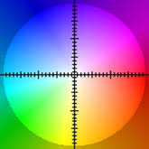
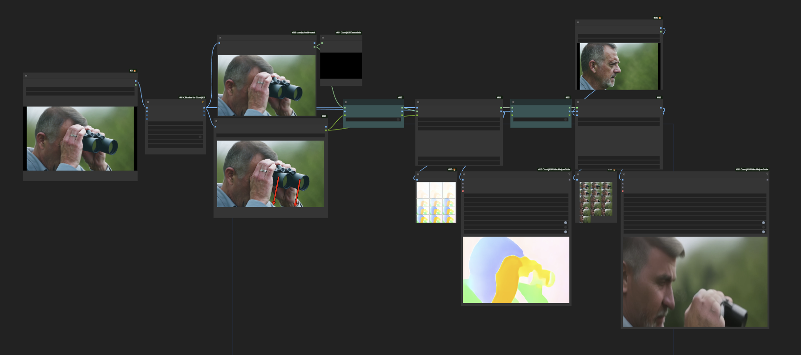
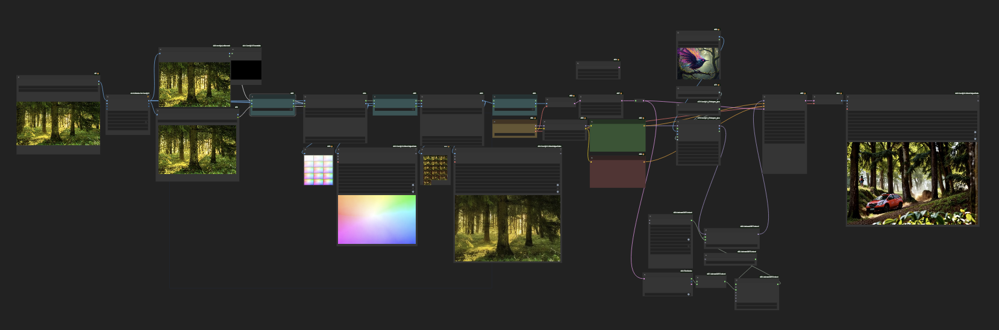

# ComfyUI-IG-Motion-I2V
 

[ComfyUI](https://github.com/comfyanonymous/ComfyUI) implementation of [Motion-I2V](https://xiaoyushi97.github.io/Motion-I2V/)
This is currently a diffusers wrapper with code adapted from [https://github.com/G-U-N/Motion-I2V](https://github.com/G-U-N/Motion-I2V)

Find me on [Twitter](https://x.com/idgallagher) or [Banodoco](https://discord.gg/hw5qQJ4AM8)

## Updates
- [2024/9/24] 🔥 First Release
- [2024/9/23] 🔥 Interactive Motion Painter UI for ComfyUI
- [2024/9/20] 🔥 Added basic IP Adapter integration
- [2024/9/16] 🔥 Uodated model code to be compatible with Comfy's diffusers version

## TODO
- Convert the code to be Comfy Native
- Reduce VRAM usage
- More motion controls
- Train longer context models

## Nodes
- ***MI2V Flow Predictor*** takes as input a first frame and option motion prompt, mask and vectors. Outputs a predicted optical flow for a 16 frame animation with the input image as the first frame. You can view a preview of the motion where the colors correspond to movement in 2 Dimensions

  
- ***MI2V Flow Animator*** takes the predicted flow and a starting image and generates a 16 frame animation based on these
- ***MI2V Motion Painter*** allows you to draw motion vectors onto an image to be used by MI2V Flow Predictor
- ***MI2V Pause*** allows you to pause the execution of the workflow. Useful for loading a resized image into MI2V Flow Predictor or checking you like the predicted motion before committing to further animation

## Instructions
Here are some example workflows. They can be found along with their input images [here](examples):
- **[Motion Painter](examples/MI2V-Painter.json)** Here we use motion painting to instruct the binoculars to be lowered. This causes the man's face to be shown, however the model doesn't know what this face should look like as it wasn't in the initial image. To help, we give it a second image of the man's face via a simple IP Adapter (Once the nodes are ComfyUI native this will work even better if we use Tiled IP Adapter)

  https://github.com/user-attachments/assets/1e35fb84-f246-4725-bfa9-6bfd955a2ee0

- **[Using motion as an input into another animation](examples/MI2V-to-ADLCM.json)** Here we use an image of a forest and a prompt of "zoom out" to get a simple video of zooming out motion. This is then input into a second Animate Diff animation to give us complex and controlled motion that would have been difficult to acheive otherwise 

  https://github.com/user-attachments/assets/27d51c9c-ecfd-4387-9769-fd7d12ff3e07

## More Videos
https://github.com/user-attachments/assets/fc0e7c3e-3788-49da-9564-e2f40bb69d98

https://github.com/user-attachments/assets/392a3dcb-8989-4e89-b3f4-c9836efe794a

## Credits
- [Motion-I2V: Consistent and Controllable Image-to-Video Generation with Explicit Motion Modeling](https://arxiv.org/abs/2401.15977)
by *Xiaoyu Shi1\*, Zhaoyang Huang1\*, Fu-Yun Wang1\*, Weikang Bian1\*, Dasong Li 1, Yi Zhang1, Manyuan Zhang1, Ka Chun Cheung2, Simon See2, Hongwei Qin3, Jifeng Dai4, Hongsheng Li1* *1CUHK-MMLab   2NVIDIA   3SenseTime  4  Tsinghua University*

- Motion Painter node was adapted from code in this node [https://github.com/AlekPet/ComfyUI_Custom_Nodes_AlekPet](https://github.com/AlekPet/ComfyUI_Custom_Nodes_AlekPet)
